# 🎓 Generador de Exámenes con Agentes de IA — Documentación Técnica

> **Proyecto:** MVP_v1 — Generador de exámenes en LaTeX propulsado por agentes de IA
> **Tesis:** USFQ
> **Fecha de documentación:** 2026-08-11

Repo de referencia con material de estudio: https://github.com/tobiager/UNNE-LSI/tree/main

---

## 📋 Tabla de contenidos

1. [Visión general](#-visión-general)
2. [Glosario (términos técnicos)](#-glosario-términos-técnicos)
3. [Arquitectura de infraestructura](#-arquitectura-de-infraestructura)
4. [Pipeline de agentes (LangGraph)](#-pipeline-de-agentes-langgraph)
5. [Proceso completo del generador (paso a paso)](#-proceso-completo-del-generador-paso-a-paso)
6. [Los agentes en detalle](#-los-agentes-en-detalle)
7. [Flujo de datos y estado](#-flujo-de-datos-y-estado)
8. [Esquemas de datos](#-esquemas-de-datos)
9. [Configuración del LLM local](#-configuración-del-llm-local)
10. [Base de datos y migraciones](#-base-de-datos-y-migraciones)
11. [Renderizado LaTeX](#-renderizado-latex)
12. [Estado del proyecto](#-estado-del-proyecto)

---

## 🧭 Visión general

Este proyecto construye un **pipeline multi-agente** que genera exámenes universitarios completos en LaTeX a partir del **syllabus/material de una materia**. El sistema:

1. **Ingiere** los materiales del profesor (PDFs, textos, presentaciones, hojas de cálculo).
2. **Planifica** la estructura del examen (distribución por nivel de Bloom, dificultad y temas).
3. **Genera** ítems de examen uno por uno con un LLM.
4. **Evalúa** cada ítem (calidad, dificultad, duplicación) y lo aprueba o rechaza.
5. **Ensambla** los ítems aprobados en un documento LaTeX.
6. **Compila** el LaTeX a PDF mediante un microservicio.

Todo orquestado por **LangGraph**, con un estado compartido que viaja entre nodos y registros de auditoría para las métricas de la tesis.

---

## 📖 Glosario (términos técnicos)

Antes de entrar en detalle, conviene aclarar algunos términos que aparecen a lo largo de esta documentación. Son conceptos clave del proyecto (y de tu tesis):

### 🎯 Blueprint (plano / plan maestro)
Del inglés "blueprint" = **plano o diseño**. En este proyecto, un `ExamBlueprint` es el **"plano" del examen**: define *cuántas* preguntas tendrá, *cómo se reparten* por nivel de dificultad, por tema y por nivel cognitivo. Es la **receta** que dice "este examen debe tener X preguntas fáciles de 'recordar' sobre el tema Y, Z preguntas difíciles de 'analizar' sobre el tema W", etc.

> **Analogía:** si el examen fuera una pizza, el blueprint es la receta que dice cuánta masa, cuánto queso y cuántos ingredientes de cada tipo usar.

### 🌱 Niveles de Bloom (taxonomía de Bloom)
La **Taxonomía de Bloom** es una clasificación de los **niveles de pensamiento** que una pregunta puede exigir al estudiante. Va de lo más simple (memorizar) a lo más complejo (crear):

| Nivel | Qué exige al estudiante | Ejemplo de pregunta |
|---|---|---|
| 🧠 **Recordar** | Memorizar y recordar datos | "¿Qué es el estudio de mercado?" |
| 📖 **Comprender** | Explicar con sus palabras | "Explica por qué es importante el estudio de mercado" |
| 🛠 **Aplicar** | Usar el conocimiento en una situación | "Calcula el punto de equilibrio con estos datos" |
| 🔍 **Analizar** | Descomponer y relacionar | "Compara los flujos financieros de dos proyectos" |
| ⚖️ **Evaluar** | Juzgar y argumentar | "Evalúa si el proyecto es viable y justifica" |
| 💡 **Crear** | Diseñar algo nuevo | "Diseña un plan de negocios para un emprendimiento" |

El pipeline usa estos niveles para **asegurar que el examen tenga un balance cognitivo** (no solo memorización).

### 🎚 Dificultad (`Difficulty`)
Nivel de complejidad percibida de la pregunta: `facil`, `medio`, `dificil`. Se distribuye según el blueprint.

### 📝 Ítem / pregunta (`ItemSpec` y `GeneratedItem`)
- **`ItemSpec`** ("spec" = especificación): la **ranura** que el Planificador asigna. Dice exactamente *qué* hay que generar: tema, nivel de Bloom, dificultad y tipo de pregunta.
- **`GeneratedItem`**: el **resultado concreto** que el Generador produce: el enunciado, las opciones, la respuesta esperada y la solución.

### 🔁 Ítem / Slots (ranuras)
En este diseño, el examen se construye llenando "ranuras" (slots). Cada `ItemSpec` es una ranura que el Generador debe llenar con una pregunta concreta.

### 🤖 Agente
En este contexto, un "agente" es una **función del grafo** (no un agente autónomo complejo). Cada uno hace una tarea específica del pipeline. La "orquestación" entre ellos la hace LangGraph.

### 🧠 LLM / modelo de razonamiento
**LLM** = Large Language Model (modelo de lenguaje grande). Aquí usas **DeepSeek-V4-Flash-0731** servido localmente con **vLLM**. Es un "modelo de razonamiento": puede "pensar" (generar un razonamiento interno) antes de responder. El parámetro `reasoning_effort` controla cuánto "piensa".

### 🗂 Syllabus
El **programa o temario** de la materia: la lista de temas, subtemas y su importancia relativa. Es la "materia prima" que el sistema usa como contexto para generar preguntas relevantes.

### 🔍 Deduplicación
Proceso de detectar si una pregunta generada es **demasiado similar** a otra ya aprobada, para evitar preguntas repetidas en el examen.

---

## 🏗 Arquitectura de infraestructura

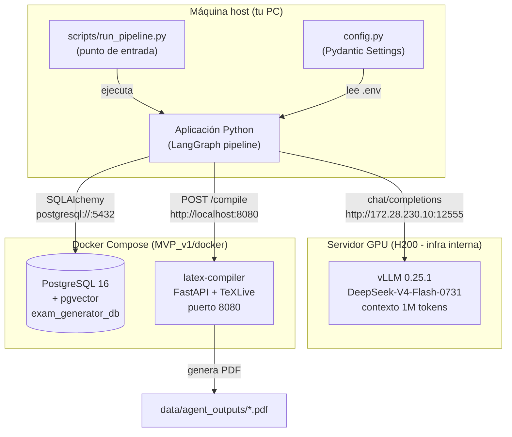

### Componentes y puertos

| Componente | Tecnología | Ubicación | Puerto |
|---|---|---|---|
| **Aplicación principal** | Python + LangGraph | `MVP_v1/` | — |
| **API** | FastAPI | `main.py` | `8000` |
| **LLM local** | vLLM + DeepSeek-V4-Flash-0731 | `172.28.230.10` | `12555` |
| **Base de datos** | PostgreSQL 16 + pgvector | Docker (`postgres-db`) | `5432` |
| **Compilador LaTeX** | FastAPI + TeXLive | Docker (`latex-compiler`) | `8080` |
| **Servicio de embeddings** | FastAPI + sentence-transformers (bge-m3) | Docker (`embedding-service`) | `8081` |

---

## 🧠 RAG (Retrieval-Augmented Generation)

El sistema usa **RAG** para que el LLM no tenga que leer todo el material cada vez. En lugar de eso, el material se **indexa una vez** (con embeddings) en la BD, y al generar cada pregunta se **recuperan solo los fragmentos relevantes**.

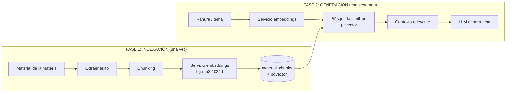

### Fase 1 — Indexación
- `scripts/index_material.py` o `POST /subjects/{id}/index` leen el material, lo dividen en chunks y generan embeddings.
- Los chunks + embeddings se guardan en `material_chunks` (con pgvector `vector(1024)`).

### Fase 2 — Generación con RAG
- El `generator_node` consulta `retrieve_chunks()` con el tema de la ranura.
- Recupera los `top_k` fragmentos más relevantes (similitud coseno) y se los pasa al LLM como contexto.
- Configurable vía `blueprint.retrieval` (`top_k`, `min_score`, `use_rag`).

### 💾 Persistencia
- Los ítems aprobados se guardan en `generated_questions` con sus embeddings (`persist_generated_items`).
- Esto crea un dataset de preguntas para experimentación y deduplicación futura.

---

## 🔀 Pipeline de agentes (LangGraph)

El corazón del sistema es un **grafo de estado** (`StateGraph`) donde cada nodo es un agente/función y las aristas son condicionales.

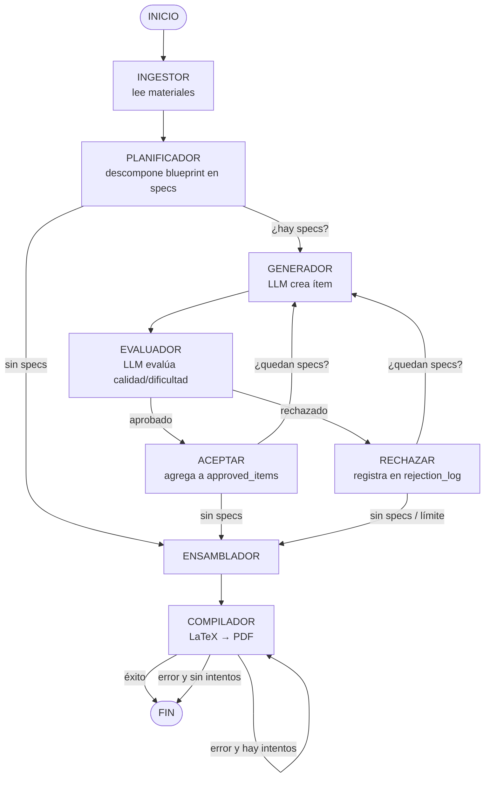

### Condicionales del grafo

| Condicional | Función | Decide |
|---|---|---|
| `after_evaluation` | ¿El ítem fue aprobado? | `accepted` / `rejected` |
| `should_continue` | ¿Quedan specs por generar? | `continue` / `assemble` |
| `should_retry_compilation` | ¿Reintentar compilación? | `retry` / `end` |

---

## 🔄 Proceso completo del generador (paso a paso)

Para que quede claro cómo funciona todo el sistema de principio a fin, aquí está el recorrido completo con un ejemplo concreto. Imagina que quieres generar un examen de **Economía Aplicada** con 8 preguntas.

### Paso 1 — Entrada de datos
El profesor sube sus materiales (PDFs, presentaciones, guías). En nuestro caso, la materia de prueba está en `data/inputs/Economia_Aplicada/` (35 archivos: apuntes, filminas, parciales, práctica).

### Paso 2 — Ingestor / Indexación: extraer el conocimiento
El **Ingestor** lee todos esos archivos (PDF, DOCX, PPTX, XLSX, texto) y extrae el texto. Con **RAG**, este material se **indexa una vez**: se divide en chunks (~2000 caracteres), se generan embeddings (bge-m3, 1024 dims) y se guardan en `material_chunks`. Así, en vez de releer todo cada vez, el sistema puede **recuperar solo los fragmentos relevantes** para cada pregunta.

### Paso 3 — Planificador: diseñar el examen (blueprint)
Definimos el **blueprint**: 8 preguntas, repartidas así:
- **Bloom**: 25% recordar, 25% comprender, 25% aplicar, 25% analizar → 2 de cada.
- **Dificultad**: 40% fácil, 40% medio, 20% difícil.
- **Temas**: 30% estudio de mercado, 30% flujos financieros, 25% análisis económico, 15% precios.

El Planificador convierte esta "receta" en **8 ranuras concretas** (`ItemSpec`), cada una especificando exactamente qué generar. Por ejemplo:
> "Ranura #1: tema 'Estudio de Mercado', nivel 'recordar', dificultad 'fácil', tipo 'opción múltiple'."

Este paso es **programático** (no usa el LLM): es determinista y barato.

### Paso 4 — Generador: crear cada pregunta (bucle)
El sistema entra en un **bucle**: toma una ranura a la vez y le pide al LLM que genere la pregunta correspondiente.

```
for cada ranura pendiente:
    1. Generador: LLM crea la pregunta (GeneratedItem) según la ranura
    2. Evaluador: LLM evalúa si es buena, si la dificultad coincide,
       y si no es duplicada de otra ya aprobada
    3. ¿Aprobada? → se agrega a "approved_items" y se pasa a la siguiente ranura
    4. ¿Rechazada? → se reintenta (hasta 3 veces) o se abandona la ranura
```

> 💡 **Detalle clave:** el Generador usa `with_structured_output` para que el LLM devuelva **JSON estricto** con el formato `GeneratedItem`. El LLM **nunca escribe LaTeX** — solo produce datos estructurados (enunciado, opciones, respuesta). El LaTeX se genera después, programáticamente.

### Paso 5 — Ensamblador: armar el documento
Cuando ya no quedan ranuras, el **Ensamblador** junta todos los ítems aprobados, los ordena y genera el **código LaTeX** del examen completo (portada, tabla de calificación, preguntas, soluciones).

### Paso 6 — Compilador: generar el PDF
El **Compilador** envía el LaTeX al microservicio `latex-compiler` (Docker), que ejecuta `pdflatex` **dos veces** (necesario para resolver totales de puntos y referencias) y devuelve el **PDF final** en `data/agent_outputs/`.

### Resultado
El sistema entrega un **examen PDF completo**, listo para imprimir, junto con un resumen JSON de todo el proceso (ítems aprobados, rechazos, llamadas al LLM, etc.).

---


## 🤖 Los agentes en detalle

Cada agente es una función pura que recibe el estado y devuelve un dict parcial que LangGraph mezcla con el estado global.

### 1. INGESTOR — `ingestor_node`
**Función:** leer los materiales crudos del profesor y producir un resumen del syllabus.

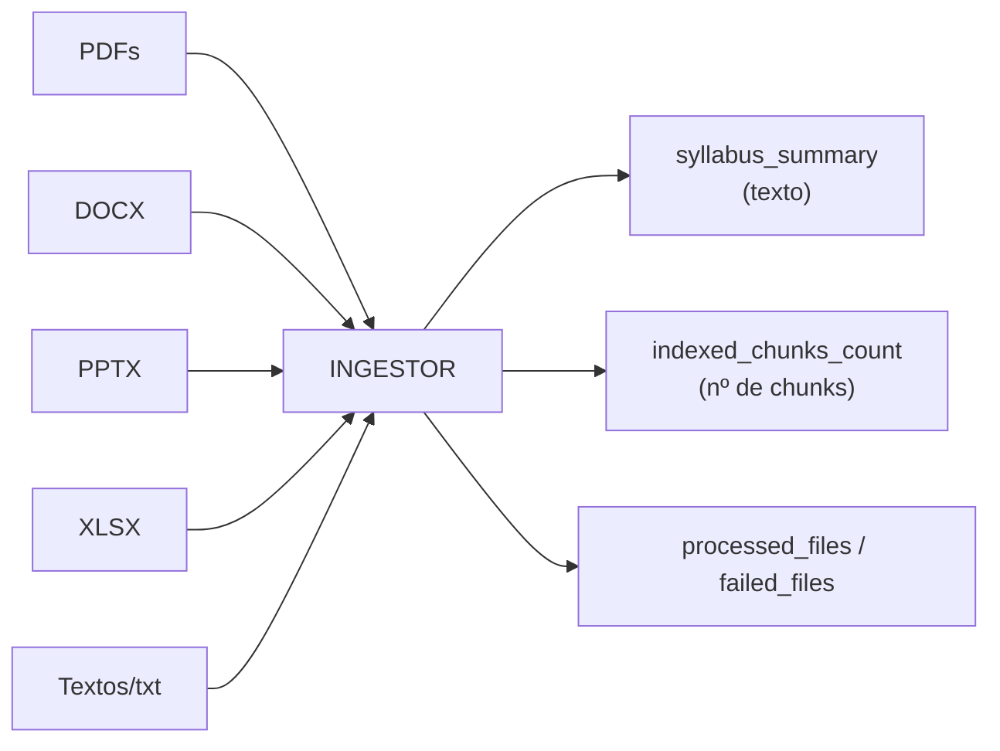

- Lee **PDFs** con PyMuPDF, **DOCX** con python-docx, **PPTX** con python-pptx, **XLSX** con openpyxl, y archivos de texto plano.
- Hace un **chunking heurístico** (~1 chunk por cada 2000 caracteres).
- **No llama al LLM** en el MVP (el indexado vectorial completo es una fase posterior).
- Reporta qué archivos procesó (`processed_files`) y cuáles fallaron (`failed_files`).
- Salidas: `syllabus_summary`, `indexed_chunks_count`, `processed_files`, `failed_files`.

> 💡 En la prueba real con la materia "Economía Aplicada", el ingestor procesó los 34 archivos (PDF, DOCX, PPTX, XLSX) generando **465 chunks** sin ningún fallo.

---

### 2. PLANIFICADOR — `planner_node`
**Función:** descomponer el `ExamBlueprint` en una lista explícita de `ItemSpec` (ranuras).

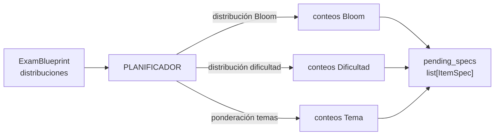

- **Determinista y programático** (no gasta llamadas al LLM): muestrea de las distribuciones.
- Cada `ItemSpec` especifica exactamente: tema, nivel de Bloom, dificultad, tipo de pregunta y puntaje.
- Salidas: `pending_specs` (cola de ranuras por generar).

---

### 3. GENERADOR — `generator_node`
**Función:** tomar el siguiente spec pendiente y generar un `GeneratedItem` con el LLM.

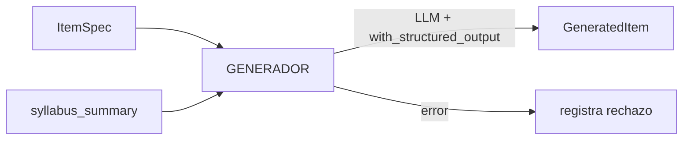

- Usa `generator_llm` con `reasoning_effort: none` (necesario para que el JSON salga en `content`, ver nota abajo).
- `with_structured_output(GeneratedItem)` fuerza el formato JSON estricto.
- Hace `pop(0)` del spec y lo pasa al evaluador.
- Salidas: `current_item`, `current_spec`, `pending_specs` (restante).

> ⚠️ **Nota importante (vLLM):** este modelo es de razonamiento. Si se usa `reasoning_effort > none` junto con `with_structured_output`, el modelo pone todo el output en el campo `reasoning` y deja `content` vacío → el JSON no se puede parsear → el ítem se rechaza. Por eso, tanto el Generador como el Evaluador usan `reasoning_effort: "none"` para que el JSON estructurado salga en `content`.

---

### 4. EVALUADOR — `evaluator_node`
**Función:** evaluar el ítem generado (calidad, dificultad, duplicación).

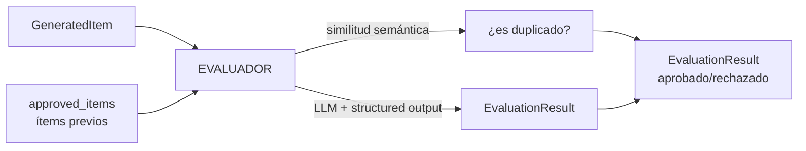

- **Chequeo de duplicación** contra ítems ya aprobados (solapamiento de tokens).
- **Evaluación de calidad** con `evaluator_llm` (`reasoning_effort: none`, temperatura baja).
- La duplicación **anula** cualquier aprobación.
- Salidas: `current_evaluation`.

---

### 5. ENSAMBLADOR — `assembler_node`
**Función:** armar el `CompiledExam` y generar el LaTeX final.

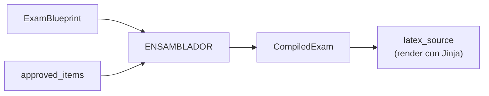

- Construye el `CompiledExam` con los ítems aprobados.
- Renderiza el LaTeX con `render_exam()` (Jinja + template `base_exam.tex.jinja`).
- Salidas: `compiled_exam`, `latex_source`.

---

### 6. COMPILADOR — `compiler_node`
**Función:** enviar el LaTeX al microservicio y guardar el PDF.

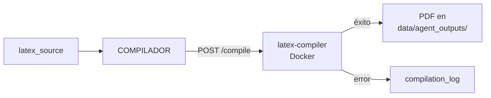

- Envía el LaTeX vía HTTP al microservicio (`requests`).
- El microservicio ejecuta `pdflatex` **dos veces** (necesario para resolver totales de puntos y referencias cruzadas de la clase `exam`).
- Reintenta hasta `max_compilation_attempts` (3).
- Guarda el PDF en `data/agent_outputs/`.
- Salidas: `compiled_exam.pdf_path`, `compilation_log`, `status`.

> ⚠️ **Nota técnica:** `pdflatex` debe ejecutarse 2 veces. En una sola pasada, deja avisos "Rerun to get point totals right" que hacen que el `returncode` sea distinto de 0 aunque el PDF se haya generado. Por eso el microservicio considera éxito si el PDF existe, independientemente del `returncode`.

---

## 📦 Flujo de datos y estado

El estado compartido (`ExamGenerationState`) viaja por todo el grafo. Se divide en secciones:

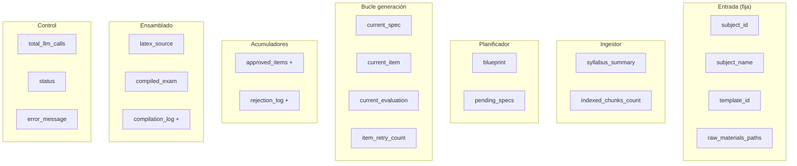

### Acumuladores con reducer `operator.add`

Los campos marcados con `+` usan el patrón estándar de LangGraph: cuando un nodo retorna un elemento nuevo, **se concatena** a la lista existente (no la sobreescribe). Esto permite que cada nodo del bucle solo maneje *su* ítem.

---

## 🧩 Esquemas de datos

Definidos en `src/schemas/exam.py`:

| Esquema | Descripción | Campos clave |
|---|---|---|
| `BloomLevel` | Enum de niveles de Bloom | `recordar`…`crear` |
| `Difficulty` | Enum de dificultad | `facil`, `medio`, `dificil` |
| `QuestionType` | Enum de tipos de pregunta | `opcion_multiple`, `verdadero_falso`, `respuesta_corta`, `desarrollo` |
| `AnswerOption` | Opción de respuesta | `text`, `is_correct` |
| `GeneratedItem` | Contrato del LLM Generador | `topic`, `bloom_level`, `difficulty`, `question_type`, `statement`, `options`, `expected_answer`, `solution_explanation`, `points` |
| `EvaluationResult` | Salida del Evaluador | `approved`, `quality_score`, `difficulty_match`, `is_duplicate`, `similarity_score`, `rejection_reason` |
| `ExamBlueprint` | Estructura del examen | `total_questions`, `bloom_distribution`, `difficulty_distribution`, `topics_weight`, `estimated_duration_minutes` |
| `ItemSpec` | Ranura específica del Planificador | `topic`, `bloom_level`, `difficulty`, `question_type`, `points` |
| `CompiledExam` | Resultado final | `items`, `latex_source`, `pdf_path` |

> **Clave de diseño:** el LLM Generador **nunca genera LaTeX directamente** — solo produce la estructura `GeneratedItem`. El LaTeX se genera programáticamente en el ensamblador. Esto evita errores de sintaxis LaTeX del modelo.

---

## ⚙️ Configuración del LLM local

Definida en `src/config.py` y `src/agents/llm.py`:

| Parámetro | Valor | Descripción |
|---|---|---|
| `llm_model` | `deepseek-ai/DeepSeek-V4-Flash-0731` | Modelo servido |
| `llm_base_url` | `http://172.28.230.10:12555/v1` | Endpoint vLLM |
| `llm_max_tokens` | `65536` | Salida máxima por llamada |
| `llm_temperature` | `0.7` | Temperatura del generador |
| `llm_temperature_evaluator` | `0.2` | Temperatura del evaluador (más determinista) |
| `llm_reasoning_generator` | `none` | Razonamiento del generador (para JSON válido) |
| `llm_reasoning_evaluator` | `none` | Razonamiento del evaluador (para JSON válido) |
| `max_context_chars` | `6000` | Contexto del syllabus inyectado |

> ⚠️ **Por qué `reasoning_effort: none`:** el servidor vLLM soporta 7 niveles de razonamiento (`none`, `minimal`, `low`, `medium`, `high`, `xhigh`, `max`). Pero al usar `with_structured_output` (JSON), cualquier nivel > `none` hace que el modelo ponga el razonamiento en el campo `reasoning` y deje `content` vacío, rompiendo el JSON. Por eso Generador y Evaluador usan `none`.

**El servidor vLLM** (0.25.1) soporta:
- **Contexto de 1M tokens** (`max_model_len: 1048576`)
- **Salida hasta ~100k+ tokens** (probado empíricamente)
- **7 niveles de `reasoning_effort`**: `none`, `minimal`, `low`, `medium`, `high`, `xhigh`, `max`
- **Structured output**: `json_object`, `json_schema`, `regex`, `grammar`

### Configuración de embeddings (RAG)

| Parámetro | Valor | Descripción |
|---|---|---|
| `embedding_model` | `BAAI/bge-m3` | Modelo de embeddings (open-source) |
| `embedding_dim` | `1024` | Dimensión del vector |
| `embedding_url` | `http://localhost:8081/v1/embeddings` | Servicio de embeddings (Docker) |

Los embeddings se generan en un **microservicio Docker** (`embedding-service`, puerto 8081) que sirve `BAAI/bge-m3` como endpoint OpenAI-compatible. El pipeline los usa para indexar el material (RAG) y para la deduplicación/persistencia.

---

## 🗄 Base de datos y migraciones

Modelos en `src/database/models.py` (SQLAlchemy + pgvector):

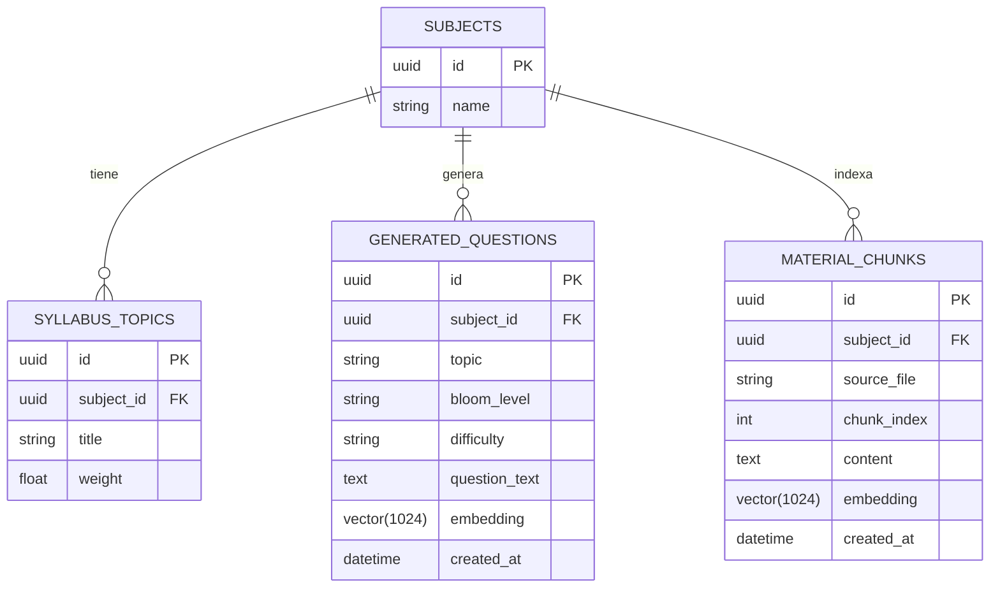

- **`Connection`**: `src/database/connection.py` (engine + `SessionLocal`).
- **Migraciones**: Alembic en `src/database/migrations/`. `env.py` inyecta la URL real desde `.env`.
- **pgvector**: las columnas `embedding` están tipadas como `vector(1024)` (modelo bge-m3).

---

## 📄 Renderizado LaTeX

- **Templates**: `src/templates/base_exam.tex.jinja` (Jinja2).
- **Utilidades**: `src/utils/latex_templates.py` — `escape_latex()`, `render_item()`, `render_exam()`.
- **Registry**: `src/templates/registry.py` — mapea `TemplateId` → archivo de template.
- **Nota técnica**: el entorno Jinja usa delimitadores de comentario `<#`/`#>` para evitar colisión con las macros LaTeX `{#1}`.

---

## 🚦 Estado del proyecto

### ✅ Implementado y validado
- Infraestructura Docker (Postgres + pgvector + latex-compiler + embedding-service)
- Configuración Pydantic + LLM local
- Todos los esquemas Pydantic
- Estado del grafo (`state.py`)
- Los 6 nodos (`nodes.py`)
- El grafo compilado (`graph.py`)
- Render LaTeX (validado end-to-end → PDF real)
- Compilación LaTeX → PDF (validado contra el microservicio)
- **Ingestor multi-formato** (PDF, DOCX, PPTX, XLSX, texto)
- **Pipeline end-to-end** con materia real (Economía Aplicada): 7/8 ítems aprobados, PDF generado
- **`scripts/run_pipeline.py`** — punto de entrada ejecutable
- **RAG completo**: indexación + recuperación por similitud (pgvector)
- **Persistencia** de ítems generados en `generated_questions`
- **API** (`main.py`): registrar materia, indexar material, generar exámenes
- **Blueprint enriquecido**: `retrieval` config y `metadata` para experimentación

### 🆕 Implementado (agente conversacional — Fase 2 del plan)
- **Campos de verificación** humano/IA en `generated_questions` (migración `c3d4e5f6a7b8`)
- **Estructura completa** de la pregunta persistida (antes solo el texto)
- **Service layer de escritura segura** (`src/bank/service.py`): preguntas verificadas por humano inmutables para el agente
- **Agente conversacional** (`src/agents/conversational/`) con human-in-the-loop
- **Endpoint OpenAI-compatible** `/v1/chat/completions` (streaming con `delta.content`) para conectar OpenWebUI
- **OpenWebUI** en Docker Compose como interfaz conversacional
- **Verificación por IA** (`src/agents/verifier.py`) con prioridad de revisión
- **Checkpointer persistente** con `PostgresSaver` (PostgreSQL) para retomar conversaciones
- **Tools**: `listar_materias`, `buscar_preguntas`, `generar_pregunta`, `guardar_pregunta`, `confirmar_verificacion_humana`, `generar_examen_pdf`
- **Generación de examen en PDF** y subida como adjunto nativo a OpenWebUI (`src/api/openwebui.py`)
- **Docs**: `docs/metrics.md` y `docs/cost_analysis.md`

### 🔬 Validado empíricamente (endpoint LLM)
- `max_tokens=100000` aceptado
- Contexto de 36k tokens procesado
- 7 niveles de `reasoning_effort`
- Structured output compatible (con `reasoning_effort: none`)

### 🐛 Bugs encontrados y corregidos
- **`reasoning_effort` + structured output**: con `reasoning_effort > none`, vLLM deja `content` vacío → JSON inválido → ítems rechazados. Corregido usando `none`.
- **Compilación de doble pasada**: `pdflatex` necesita 2 pasadas; el microservicio ahora ejecuta `pdflatex` dos veces y considera éxito si el PDF existe.
- **Embeddings**: `sentence-transformers` arrastra torch con CUDA → se instala `torch` CPU primero, luego `sentence-transformers` normal.

### ⏳ Pendiente / por validar
- Métricas de tesis (tasa de rechazo, % de dificultad, etc.)
- Deduplicación con embeddings reales (hoy usa solapamiento de tokens)
- Frontend/UI para subir archivos y generar exámenes

---

## 💬 Agente Conversacional (OpenWebUI + human-in-the-loop)

### Arquitectura

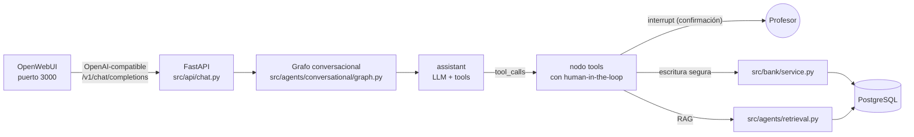

### Herramientas del agente (tools)

| Tool | Tipo | Descripción |
|---|---|---|
| `listar_materias` | Lectura | Lista las materias registradas (id + nombre) |
| `buscar_preguntas` | Lectura | Recupera preguntas del banco (no genera) |
| `generar_pregunta` | Lectura | Genera UNA pregunta con RAG (no guarda) |
| `guardar_pregunta` | **Escritura** | Guarda en el banco + verificación por IA |
| `confirmar_verificacion_humana` | **Escritura** | Marca `verified_by_human=True` |
| `generar_examen_pdf` | **Escritura** | Genera examen, compila a PDF y lo adjunta a OpenWebUI |

### Flujo con human-in-the-loop

```mermaid
graph TD
    U[Profesor: "dame 20 preguntas de estos temas"] --> A[assistant]
    A -->|buscar_preguntas| B[Recupera del banco]
    A -->|generar_pregunta| C[Genera UNA pregunta]
    C -->|muestra al profesor| D{¿Confirmas guardar?}
    D -->|sí| E[guardar_pregunta<br/>+ verificación IA]
    D -->|no| A
    E --> F{¿Confirmas verificación humana?}
    F -->|sí| G[confirmar_verificacion_humana<br/>verified_by_human=True]
    F -->|no| A
```

**Puntos de decisión humana:**
1. Antes de **guardar** una pregunta (`guardar_pregunta`).
2. Antes de marcar **verificación humana** (`confirmar_verificacion_humana`).

Estos puntos usan `interrupt` de LangGraph: el grafo **pausa** y espera la aprobación del profesor. Si no se aprueba, la acción no se ejecuta.

### Restricciones de seguridad de escritura

- Toda escritura pasa por `src/bank/service.py`.
- `update_question` / `delete_question` lanzan `SecurityError` si `verified_by_human=True`.
- `set_human_verification()` solo lo invoca la confirmación humana explícita del chat.

### Persistencia del contexto de conversación

El grafo usa un **checkpointer persistente** con `PostgresSaver` (PostgreSQL). Las conversaciones se retoman entre reinicios usando el `thread_id`. Si no hay BD disponible, cae a `InMemorySaver` (efímero).

### Entrega de PDFs (adjunto nativo a OpenWebUI)

Cuando el agente genera un examen (`generar_examen_pdf`):
1. Compila el LaTeX a PDF vía el microservicio `latex-compiler`.
2. Sube el PDF a OpenWebUI con `src/api/openwebui.py` (`POST /api/v1/files/`).
3. Devuelve un enlace markdown `[Descargar el PDF](http://localhost:3000/api/v1/files/{id}/content)` que OpenWebUI renderiza como enlace clicable en el chat.

---

## 🛠 Cómo ejecutar

```bash
# 1. Activar entorno
source .venv/Scripts/activate

# 2. Levantar infraestructura (Postgres + latex-compiler + embedding-service
#    + exam-app + open-webui)
cd docker && docker-compose up -d --build

# 3. Migraciones (el contenedor exam-app las aplica al arrancar; también manual)
alembic upgrade head

# 4a. Indexar el material de una materia (RAG)
.venv/Scripts/python.exe scripts/index_material.py \
    --name "Economía Aplicada" \
    --materials "data/inputs/Economia_Aplicada/**/*.pdf"

# 4b. Ejecutar el pipeline completo (genera un PDF)
.venv/Scripts/python.exe scripts/run_pipeline.py

# 5a. (Opcional) Levantar la API
.venv/Scripts/python.exe -m uvicorn main:app --host 0.0.0.0 --port 8000
#    POST /subjects        → registrar materia
#    POST /subjects/{id}/index → indexar material
#    POST /exams/generate  → generar examen

# 5b. Agente conversacional (OpenAI-compatible)
#    GET  /v1/models               → listar modelos
#    POST /v1/chat/completions     → conversar con el agente
#    POST /v1/chat/completions     → reanudar confirmación humana (resume)

# 6. OpenWebUI (interfaz conversacional)
#    Abrir http://localhost:3000  → conecta al agente automáticamente
```

