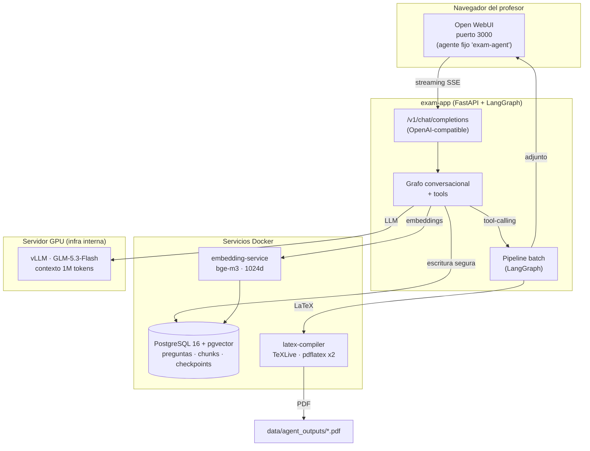
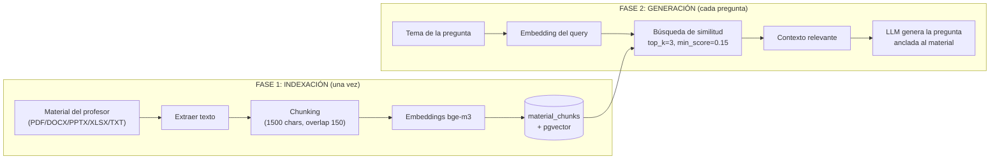
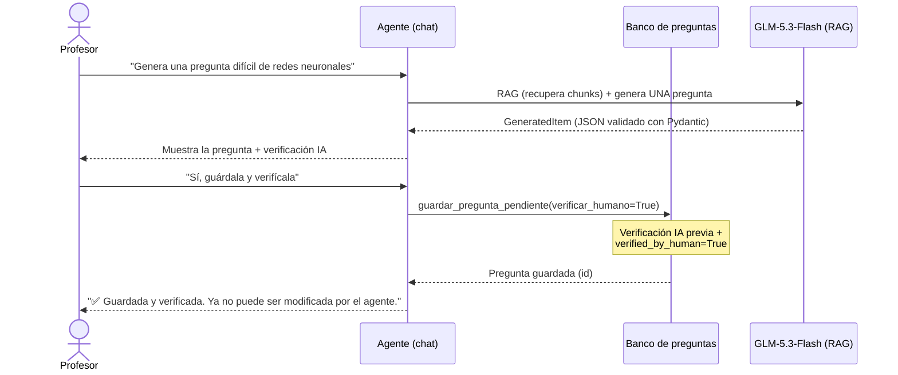
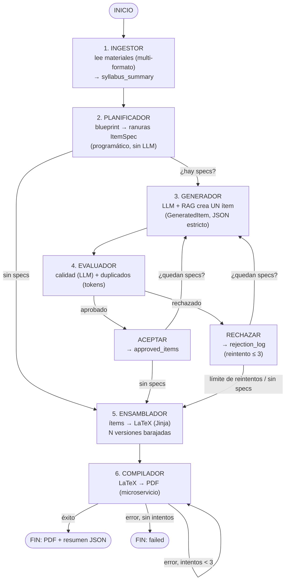
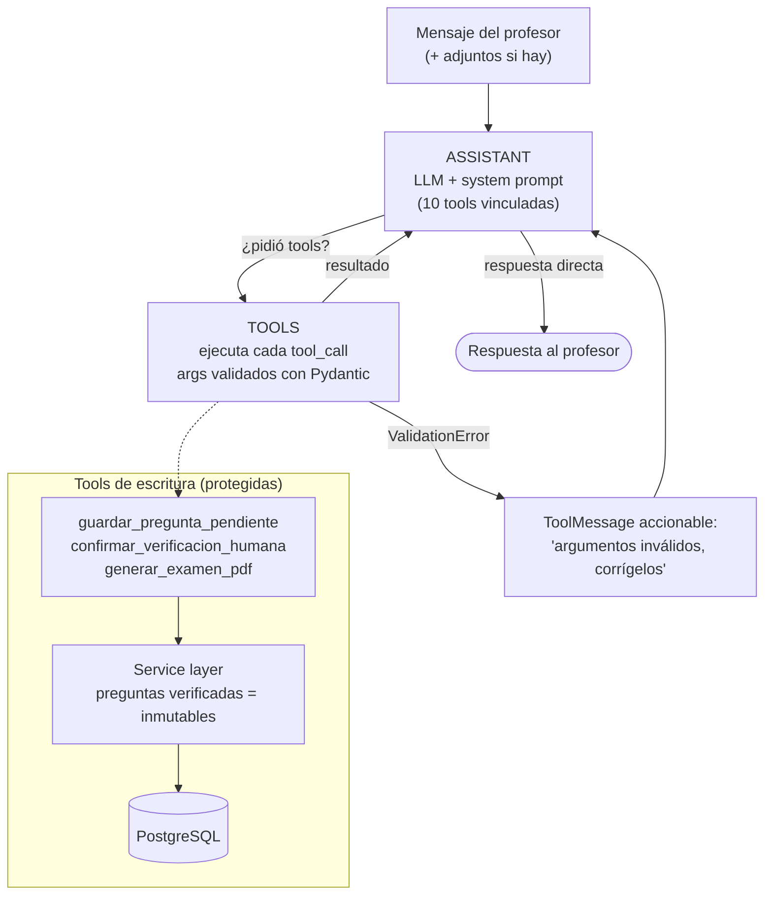
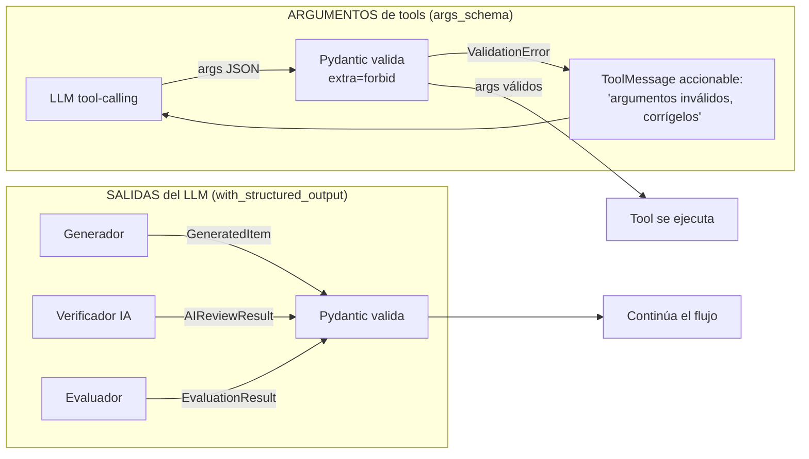

# 📊 Informe de Avance — Generador Conversacional con Agente IA para Exámenes

> **Tesis:** USFQ — Cohorte 3 (2da corte) · **Proponente:** Felipe Grijalva · **Estudiante:** Danilo Pilacuán
> **Fecha del informe:** 2026-09-17
> **Fechas clave:** implementación completa en **noviembre** · defensa **14–21 de diciembre**

Este informe resume **qué está implementado**, **qué falta** y **cómo funciona** el sistema (arquitectura + loop de agentes). Sirve como base para el seguimiento quincenal con el tutor y para el capítulo de implementación del escrito.

---

## 1. Avance del desarrollo

### 1.1 Elementos de acción del proyecto (según `Requisitos/generador_conversacional.md`)

| # | Elemento de acción | Estado | Evidencia |
|---|---|---|---|
| 1 | Documentar el flujo del agente con diagrama (decisiones, entradas, salidas, intervención humana) | ✅ **Completo** | `ARCHITECTURE.md`: 13 diagramas mermaid (pipeline, RAG, estado, conversacional) |
| 2 | Evolucionar el MVP a interfaz conversacional (chat, sin frontend tradicional) | ✅ **Completo** | OpenWebUI + endpoint OpenAI-compatible `/v1/chat/completions` (`src/api/chat.py`) |
| 3 | Campos de verificación humana y verificación por IA en la BD | ✅ **Completo** | `verified_by_human`, `verified_by_ai`, `ai_review_notes`, `ai_review_priority` en `generated_questions` (migración `c3d4e5f6a7b8`) |
| 4 | Restricciones de seguridad del agente sobre la BD | ✅ **Completo** | Service layer (`src/bank/service.py`): preguntas verificadas por humano **inmutables** (`SecurityError` en update/delete) |
| 5 | Investigar métricas de evaluación (agente + RAG) | 🟡 **Documentado, no implementado** | `docs/metrics.md` define las métricas; falta instrumentar y medir |
| 6 | Analizar costos comparativos local vs. nube | 🟡 **Documentado, por actualizar** | `docs/cost_analysis.md` con comparativa; falta medir tokens reales del pipeline |
| 7 | Compartir repositorio (privado) con Felipe | ✅ Hecho | Fuera del código |
| 8 | Seguimiento con Felipe cada 2 semanas | ✅ En curso | Este informe es parte del seguimiento |

### 1.2 Lo que está implementado y validado

**Infraestructura (Docker Compose, 5 servicios):**
- PostgreSQL 16 + pgvector (banco de preguntas + chunks RAG + checkpoints de conversaciones)
- Servicio de embeddings (bge-m3, 1024 dims, endpoint OpenAI-compatible)
- Compilador LaTeX (FastAPI + TeXLive, doble pasada `pdflatex`)
- `exam-app` (FastAPI + LangGraph, aplica migraciones al arrancar)
- Open WebUI (interfaz conversacional, modo "producción" con agente fijo)

**Pipeline batch de generación de exámenes (LangGraph):**
- 6 nodos: ingestor → planner → generator → evaluator → assembler → compiler
- RAG completo: indexación multi-formato (PDF, DOCX, PPTX, XLSX, TXT) + recuperación por similitud (pgvector)
- Validado end-to-end con materia real (Economía Aplicada): 465 chunks indexados, 7/8 ítems aprobados, PDF generado
- Múltiples versiones del examen con barajado anti-copia (estilo AMC) + hoja de respuestas

**Agente conversacional (asistente de cátedra):**
- 10 tools con validación Pydantic de entrada (`args_schema`) y salida (`with_structured_output`) — detalle completo de cada tool en §4
- Human-in-the-loop: el agente pregunta antes de guardar y antes de marcar verificación humana
- Verificación por IA previa al guardado (ambigüedad, corrección, relevancia → prioridad de revisión)
- Hiperespecialización (rechaza temas fuera del ámbito), generación de a UNA pregunta por vez
- Checkpointer persistente (PostgresSaver): las conversaciones sobreviven reinicios
- Entrega de PDFs como adjunto nativo clicable en el chat
- Agregar material por adjunto del chat (descarga, guarda físicamente en `data/inputs/<Materia>/`, chunk-ea e indexa)
- Formato tabla para listar preguntas con columnas a pedido del profesor (15 columnas disponibles)

**Calidad y robustez (última iteración, 2026-09-17):**
- Validación Pydantic en **ambas direcciones**: outputs del LLM (`with_structured_output`) y args de tool-calling (`args_schema` + catch de `ValidationError` con mensaje accionable para que el LLM corrija y reintente)
- Re-validación en puntos de consumo (ítem pendiente, verificador IA)
- Cambio de modelo a GLM-5.3-Flash (vLLM local) con ajuste de `reasoning_effort` por nodo

### 1.3 Lo que falta (priorizado)

| Prioridad | Pendiente | Detalle | Cuándo |
|---|---|---|---|
| 🔴 Alta | **Prueba end-to-end de las últimas features** | Validar en OpenWebUI: validación Pydantic de tools + formato tabla (requiere reconstruir `exam_app`) | Inmediato |
| 🔴 Alta | **Instrumentación para métricas** | Registrar por ítem: tokens usados, latencia, `quality_score`, motivo de rechazo (el `rejection_log` ya existe; falta conteo de tokens) | Octubre |
| 🔴 Alta | **Ejecutar la evaluación formal** | Dataset ground truth (muestra revisada por humano), correr RAGAS sobre el RAG, tasa de alucinación con evaluador LLM, precisión de `verified_by_ai` vs humano | Octubre–Noviembre |
| 🟡 Media | **Deduplicación con embeddings reales** | Hoy usa solapamiento de tokens (placeholder); migrar a similitud coseno con pgvector | Octubre |
| 🟡 Media | **Actualizar `docs/cost_analysis.md`** con tokens medidos | Reemplazar la estimación (~20.8k tokens/examen) por consumo real | Tras instrumentar |
| 🟡 Media | **Escrito de la tesis** | Capítulos de implementación + experimentación (usar `ARCHITECTURE.md` y este informe como base) | Noviembre |
| 🟢 Baja | Tests automatizados (`tests/` está vacío) | Al menos tests de schemas, service layer (seguridad) y render LaTeX | Noviembre |
| 🟢 Baja | Trazabilidad/monitoreo en producción | **Descartado por alcance** (decisión con Felipe) | — |

> **Riesgo de calendario:** la defensa es 14–21 de diciembre; todo el desarrollo debe cerrarse en noviembre para dejar noviembre–diciembre al escrito. La evaluación formal (métricas) es el bloque más grande pendiente y depende de la instrumentación.

---

## 2. Cómo funciona el sistema

### 2.1 Visión general

El sistema es un **asistente de cátedra IA** que ayuda a un profesor a crear, catalogar y reutilizar preguntas de examen a partir de su material de clase. Tiene **dos modos de uso** sobre la misma base de conocimiento:

1. **Modo conversacional (principal):** el profesor conversa con el agente vía OpenWebUI (chat). Le pide preguntas existentes del banco, genera nuevas una por una con confirmación humana, arma exámenes y recibe el PDF en el chat.
2. **Modo batch (API):** un pipeline LangGraph genera un examen completo de una vez a partir de un blueprint (distribución por Bloom, dificultad y temas). Útil para experimentación y para la evaluación formal.

### 2.2 Arquitectura de infraestructura

### 2.3 El RAG (Retrieval-Augmented Generation)

El LLM no lee todo el material en cada llamada. El material se **indexa una vez** y en cada generación se **recuperan solo los fragmentos relevantes**:

Esto reduce alucinaciones (las preguntas se anclan al material real), ahorra tokens y es la base de las métricas RAG de la tesis (recall@k, fidelidad, etc.).

### 2.4 Flujo de usuario conversacional (ejemplo real)

**Garantías de seguridad en el flujo:**
- Toda escritura pasa por el service layer (`src/bank/service.py`), nunca por SQL directo.
- Una pregunta `verified_by_human=True` **no puede ser modificada ni borrada** por el agente (`SecurityError`).
- La verificación humana solo se marca tras confirmación explícita del profesor en el chat.
- El agente está hiperespecializado: rechaza peticiones fuera del ámbito de exámenes.

---

## 3. El loop de agentes

El sistema tiene **dos loops** de agentes, uno por modo de uso.

### 3.1 Loop del pipeline batch (generación de examen completo)

Orquestado por LangGraph (`src/agents/graph.py`). Cada nodo es una función que recibe el estado compartido y devuelve un dict parcial; los acumuladores (`approved_items`, `rejection_log`) usan el reducer `operator.add` (cada nodo agrega, no sobreescribe).

**Puntos de decisión del loop:**

| Condicional | Decisión | Regla |
|---|---|---|
| `after_evaluation` | `accepted` / `rejected` | `EvaluationResult.approved` (la duplicación anula la aprobación) |
| `should_continue` | `continue` / `assemble` | ¿Quedan `pending_specs`? |
| `should_retry_compilation` | `retry` / `end` | ¿`compilation_attempts < 3` y no completado? |

**El bucle de generación en detalle (corazón del sistema):**

1. El **Planificador** convierte el blueprint en ranuras concretas (`ItemSpec`): "ranura #1: tema X, nivel recordar, dificultad fácil, tipo opción múltiple". Es **programático y determinista** (no gasta LLM): más barato y fácil de defender como metodología.
2. El **Generador** toma una ranura, recupera contexto RAG del tema y pide al LLM **UNA pregunta** con `with_structured_output(GeneratedItem)` — JSON estricto validado con Pydantic. El LLM **nunca escribe LaTeX**.
3. El **Evaluador** juzga calidad (LLM, temperatura baja), coincidencia de dificultad y duplicación contra lo ya aprobado.
4. Si se aprueba → se acumula y se pasa a la siguiente ranura. Si se rechaza → se reintenta (hasta 3 veces) o se abandona la ranura. Todo queda en `rejection_log` (auditoría para las métricas de la tesis).
5. Al agotarse las ranuras → **Ensamblador** (LaTeX con Jinja, N versiones barajadas) → **Compilador** (PDF).

**Guardrails anti-alucinación del loop:** una pregunta por llamada, JSON estructurado obligatorio, evaluador independiente, reintentos acotados, cap duro de llamadas al LLM (`max_total_llm_calls=200`).

### 3.2 Loop del agente conversacional (chat)

Orquestado por LangGraph con checkpointer persistente (`src/agents/conversational/graph.py`). Es el loop clásico ReAct: el LLM **razona y decide** si responde directamente o invoca una tool.

**Características del loop conversacional:**

- **Ciclo assistant → tools → assistant**: el LLM decide qué tool invocar (o ninguna); el resultado de cada tool vuelve como `ToolMessage` y el LLM continúa. El ciclo se repite hasta que el LLM responde sin tools.
- **Validación en el borde**: los args de cada tool se validan contra schemas Pydantic (`args_schema` con enums del dominio). Si el LLM pasa un valor inválido (ej. `difficulty="imposible"`), no crashea: recibe un mensaje con el detalle y **corrige y reintenta** solo.
- **Human-in-the-loop a nivel de prompt**: el agente pregunta "¿La guardo? ¿La confirmas como verificada?" antes de ejecutar tools de escritura. (El `interrupt` nativo de LangGraph se descartó porque OpenWebUI no puede reanudarlo.)
- **Puente del ítem pendiente**: `generar_pregunta` deja el ítem en un pendiente de módulo; `guardar_pregunta_pendiente` lo persiste con un clic del LLM (evita que el modelo re-especifique todos los campos y se equivoque).
- **Memoria persistente**: el checkpointer (PostgresSaver) guarda el estado por `thread_id`; la conversación sobrevive reinicios del contenedor.
- **Confirmación humana explícita** antes de: guardar una pregunta y marcarla como verificada por humano.

### 3.3 Comparación de los dos loops

| Aspecto | Pipeline batch | Agente conversacional |
|---|---|---|
| Orquestación | Grafo fijo con condicionales | Loop ReAct (LLM decide) |
| Quién decide el flujo | El blueprint + condicionales | El LLM con tool-calling |
| Control de calidad | Evaluador automático por ítem | Verificación IA + confirmación humana |
| Granularidad | Examen completo de una vez | Pregunta por pregunta, interactiva |
| Uso principal | Experimentación / evaluación formal | Uso real del profesor |
| Persistencia | Estado en memoria del run | Checkpointer Postgres (multi-sesión) |

---

## 4. Las tools del agente conversacional (detalle)

El agente expone **10 tools** al LLM, vinculadas con `bind_tools` en `src/agents/conversational/graph.py`. Cada tool encapsula **una acción acotada** y comparte cuatro invariantes:

1. **Entrada validada con Pydantic** (`args_schema` en `src/schemas/tools.py`): el JSON schema del modelo viaja al LLM (guía el tool-calling) y los args se validan en cada invocación; `extra="forbid"` rechaza campos que el LLM invente.
2. **Escritura solo vía service layer** (`src/bank/service.py`): nunca SQL directo; las preguntas verificadas por humano son inmutables.
3. **Salida en texto amigable** para el chat (markdown, tablas, emojis), con errores truncados y accionables para que el LLM pueda corregir.
4. **Hiperespecialización**: las tools de generación/busqueda rechazan temas fuera del ámbito académico (lista de keywords off-topic en `tools.py`).

### 4.1 Resumen de las 10 tools

| # | Tool | Categoría | Acción | Escribe en BD |
|---|---|---|---|---|
| 1 | `listar_materias` | Lectura | Lista materias registradas (id + nombre) | No |
| 2 | `buscar_preguntas` | Lectura | Recupera preguntas existentes del banco en tabla markdown | No |
| 3 | `generar_pregunta` | Generación | Genera UNA pregunta con RAG (no guarda) | No (deja ítem pendiente) |
| 4 | `guardar_pregunta` | Escritura | Guarda una pregunta con verificación IA previa | Sí |
| 5 | `guardar_pregunta_pendiente` | Escritura | Persiste la última pregunta generada (pendiente) | Sí |
| 6 | `confirmar_verificacion_humana` | Escritura | Marca `verified_by_human=True` (inmutabiliza) | Sí |
| 7 | `generar_examen_pdf` | Examen | Arma examen del banco → LaTeX → PDF → adjunto | No (reutiliza banco) |
| 8 | `agregar_material_archivo` | RAG | Indexa un adjunto del chat como material | Sí (chunks) |
| 9 | `listar_material_materia` | Lectura | Lista material indexado por archivo fuente | No |
| 10 | `registrar_materia` | Escritura | Registra una materia nueva (anti-duplicado) | Sí |

Las tools de escritura están declaradas en el set `WRITE_TOOLS` (`guardar_pregunta`, `guardar_pregunta_pendiente`, `confirmar_verificacion_humana`) y exigen confirmación humana explícita a nivel de prompt antes de ejecutarse.

### 4.2 Detalle de cada tool

#### 1. `listar_materias` — lectura
- **Entrada** (`ListarMateriasInput`): sin argumentos.
- **Proceso**: consulta los `Subject` registrados y formatea id + nombre.
- **Salida**: lista markdown; si no hay materias, sugiere registrar una.
- **Rol**: el id devuelto es el que el LLM debe usar como `subject_id` en las demás tools.

#### 2. `buscar_preguntas` — lectura con formato tabla
- **Entrada** (`BuscarPreguntasInput`): `subject_id` (UUID, requerido), `topic` (filtro exacto opcional), `limit` (1–100, default 20), `columns` (lista del enum `TableColumn`, opcional).
- **Proceso**: `bank.list_questions` → render de tabla markdown con `_render_questions_table`. Hay **15 columnas disponibles** a pedido del profesor: `n`, `id`, `topic`, `subtopic`, `bloom_level`, `difficulty`, `question_type`, `question_text`, `expected_answer`, `points`, `verified_by_human`, `verified_by_ai`, `ai_review_priority`, `source`, `created_at`. Si no se piden columnas se usa el set por defecto (6). Enunciados truncados a 80 caracteres, respuestas a 60, y escape de `|` para no romper la tabla.
- **Salida**: tabla markdown con encabezados legibles (`COLUMN_LABELS`) y verificación humano/IA con iconos (✅/⏳/—).
- **Guardrails**: rechazo off-topic; `limit` acotado para no volcar el banco completo en el contexto del LLM.

#### 3. `generar_pregunta` — generación con RAG (HITL)
- **Entrada** (`GenerarPreguntaInput`): `subject_id`, `subject_name`, `topic`, `difficulty` (enum `facil|medio|dificil`, default `medio`).
- **Proceso**: (1) **RAG**: recupera los top-3 chunks relevantes al tema (score mínimo 0.15) del material indexado; (2) prompt de generador con ese contexto; (3) `generator_llm.with_structured_output(GeneratedItem)` — JSON estricto validado con Pydantic; (4) deja el ítem en el **pendiente de módulo** (`_PENDING_ITEM`), puente necesario porque las tools de LangGraph no reciben el estado del grafo.
- **Salida**: la pregunta formateada para chat (sin LaTeX) + pregunta de confirmación. **NO guarda todavía**.
- **Guardrails**: UNA pregunta por llamada; off-topic; human-in-the-loop (no persiste sin confirmación); si falla el LLM devuelve el error truncado sin crashear.

#### 4. `guardar_pregunta` — escritura con verificación IA previa
- **Entrada** (`GuardarPreguntaInput`): los 11 campos completos de la pregunta — `subject_id`, `topic`, `bloom_level` (6 niveles de Bloom), `difficulty`, `question_text` (mínimo 5 caracteres), `question_type` (6 tipos), `options` (lista de `AnswerOptionIn`: `text` + `is_correct`; para `opcion_multiple` exactamente una correcta), `expected_answer`, `solution_explanation`, `subtopic`, `points` (0 < p ≤ 100).
- **Proceso**: (1) **embedding del enunciado** (bge-m3, para el RAG de preguntas); (2) **verificación por IA previa** (`review_question`): ambigüedad, corrección y relevancia → `verified_by_ai`, `ai_review_notes`, `ai_review_priority`; (3) `bank.create_question` con `source="chat"`, `created_by="agent"`.
- **Salida**: confirmación con id + resultado de la verificación IA.
- **Guardrails**: mismas reglas de dominio que `GeneratedItem` (enums del dominio, una sola opción correcta); **NO marca `verified_by_human`** (eso es una tool separada tras confirmación del profesor).

#### 5. `guardar_pregunta_pendiente` — persiste el ítem generado
- **Entrada** (`GuardarPreguntaPendienteInput`): `verificar_humano` (bool, default False — True solo si el profesor confirmó explícitamente).
- **Proceso**: consume el ítem pendiente de `generar_pregunta`; **re-valida** contra `GeneratedItem` (el dict vivió en memoria de módulo y debe cumplir el mismo esquema estricto); embedding; verificación IA; persiste; limpia el pendiente; si `verificar_humano=True` además marca la verificación humana en el mismo paso.
- **Salida**: confirmación con id, verificación IA y (si aplica) verificación humana.
- **Guardrails**: evita que el LLM re-especifique los 11 campos (fuente típica de errores de tool-calling); si el pendiente no cumple el esquema, no guarda y pide regenerar.

#### 6. `confirmar_verificacion_humana` — inmutabiliza una pregunta
- **Entrada** (`ConfirmarVerificacionInput`): `question_id` (UUID).
- **Proceso**: `bank.set_human_verification(id, verified=True)` vía service layer.
- **Salida**: confirmación de que la pregunta quedó protegida.
- **Guardrails**: solo tras confirmación explícita del profesor en el chat; una vez verificada, la pregunta es **inmutable para el agente** (`SecurityError` en update/delete desde el service layer).

#### 7. `generar_examen_pdf` — examen del banco a PDF adjunto
- **Entrada** (`GenerarExamenPdfInput`): `subject_id`, `subject_name`, `total_questions` (1–30, default 5), `use_bank` (default True), `num_versions` (1–10, default 1).
- **Proceso**: (1) recupera preguntas del banco de la materia; (2) construye un `ExamBlueprint` con distribuciones fijas de Bloom (25% × 4 niveles) y dificultad (40/40/20); (3) invoca el **pipeline batch** (`run_exam_pipeline` con `persist=False`, para no duplicar preguntas ya existentes); (4) el ensamblador genera N versiones barajadas (estilo AMC anti-copia) y el compilador LaTeX produce los PDFs; (5) sube cada PDF a OpenWebUI como **adjunto nativo clicable** (`upload_file_to_openwebui` + `build_attachment_markdown`), con fallback a enlaces HTTP directos si falla la subida.
- **Salida**: confirmación con materia, nº de preguntas y versiones + adjuntos PDF en el chat.
- **Guardrails**: si no hay preguntas en el banco, no genera (pide generar primero); errores de compilación reportados con status y mensaje.

#### 8. `agregar_material_archivo` — ingesta RAG desde el chat
- **Entrada** (`AgregarMaterialArchivoInput`): `file_id` (del tag `<file id="..."/>` del adjunto en OpenWebUI), `subject_id`, `subject_name`, `clear_previous` (default False).
- **Proceso**: (1) metadata del archivo (OpenWebUI ya extrae el texto en `data.content`); (2) descarga el binario; (3) si no hay texto extraído, lo extrae del binario (`extract_file_text`); (4) guarda el archivo físicamente en `data/inputs/<Materia>/` (`save_file_to_subject_folder`); (5) chunk-ea e indexa los fragmentos en la materia (`index_text_for_subject`, `source_label="chat:<filename>"`).
- **Salida**: confirmación con nº de fragmentos indexados y ruta física donde quedó guardado el archivo.
- **Guardrails**: avisa si el archivo no tiene texto extraíble (imagen escaneada / formato no soportado); el fallo del guardado físico no bloquea la indexación.

#### 9. `listar_material_materia` — auditoría del material indexado
- **Entrada** (`ListarMaterialInput`): `subject_id`.
- **Proceso**: agrupa los `MaterialChunk` de la materia por `source_file` con conteo de fragmentos.
- **Salida**: lista de archivos fuente + fragmentos indexados de cada uno; útil para verificar que un adjunto quedó indexado.

#### 10. `registrar_materia` — alta de materias
- **Entrada** (`RegistrarMateriaInput`): `nombre` (1–120 caracteres).
- **Proceso**: chequeo anti-duplicado case-insensitive (`ilike`) → crea el `Subject` si no existe.
- **Salida**: confirmación con el id de la materia nueva (o aviso de que ya estaba registrada, sin crear duplicado).

### 4.3 Validación Pydantic en ambas direcciones

- **Salidas del LLM**: `GeneratedItem` (generador), `AIReviewResult` (verificador IA) y `EvaluationResult` (evaluador del pipeline) se validan con `with_structured_output`; si el LLM desvía el esquema, Pydantic lo rechaza.
- **Argumentos de tools**: cada tool declara su `args_schema`; en `_call_tools_node` un `ValidationError` se convierte en `ToolMessage` accionable ("argumentos inválidos para la tool X, corrígelos: campo: mensaje", máx. 5 errores) y el LLM **corrige y reintenta** sin crashear el grafo.
- **Re-validación en puntos de consumo**: el ítem pendiente se re-valida contra `GeneratedItem` antes de persistir (tool 5) y el verificador IA re-valida su input antes de gastar una llamada al LLM.

### 4.4 Verificación por IA (`src/agents/verifier.py`)

- Evalúa cada pregunta **antes de persistir** con el LLM evaluador y `with_structured_output(AIReviewResult)`.
- **Criterios**: ambigüedad del enunciado, corrección de la respuesta esperada, relevancia al tema.
- **Salida**: `verified_by_ai`, `is_ambiguous`, `answer_correct`, `priority` (`alta|media|baja`), `notes` (para el profesor).
- **Reglas de consistencia**: ambigua o respuesta incorrecta ⇒ `verified_by_ai=False` y prioridad ≥ media; prioridad inválida se normaliza a `media`.
- **Fail-safe**: si falla el LLM, marca `verified_by_ai=False` + prioridad alta (nunca bloquea el flujo, deriva a revisión humana).
- `apply_review_to_question` nunca toca los campos de verificación IA de preguntas ya verificadas por humano.

### 4.5 Seguridad de escritura

- Toda escritura pasa por el service layer (`src/bank/service.py`); las tools nunca ejecutan SQL de escritura directo.
- `verified_by_human=True` ⇒ **inmutable**: `SecurityError` en update/delete desde el service layer.
- La verificación humana solo se marca con confirmación explícita del profesor (tools 5 y 6).
- `WRITE_TOOLS` identifica las tools de escritura para el human-in-the-loop a nivel de prompt.

### 4.6 Integraciones que usan las tools

| Integración | Tools | Detalle |
|---|---|---|
| RAG (pgvector) | 3, 8 | Recuperación top_k=3 / min_score=0.15; indexación de chunks del material |
| Embeddings (bge-m3) | 4, 5, 8 | Embedding del enunciado al guardar; indexación del material |
| Verificador IA | 4, 5 | `review_question` antes de persistir |
| Pipeline batch (LangGraph) | 7 | `run_exam_pipeline` con blueprint construido por la tool |
| Compilador LaTeX | 7 | PDFs vía microservicio (pdflatex ×2) |
| OpenWebUI | 7, 8 | Adjuntos nativos de PDF; descarga y metadata de archivos adjuntos |
| Service layer | 4, 5, 6 | Escritura segura + inmutabilidad de preguntas verificadas |

---

## 5. Próximos pasos inmediatos

1. **Reconstruir `exam_app` y validar en OpenWebUI** las últimas features (validación Pydantic de tools, formato tabla): flujo generar → guardar → verificar + "dame 5 preguntas en tabla con id, tema y dificultad".
2. **Instrumentar tokens/latencia** por llamada al LLM (base de las métricas de costo).
3. **Diseñar el dataset de evaluación** (muestra de preguntas con verificación humana como ground truth).
4. **Correr RAGAS** sobre el RAG y calcular tasa de alucinación + acuerdo IA/humano.
5. **Actualizar `docs/cost_analysis.md`** con consumo real y cerrar la comparativa local vs. nube.
6. **Empezar el escrito** (capítulo de implementación) en paralelo — objetivo: todo el desarrollo cerrado en noviembre.
