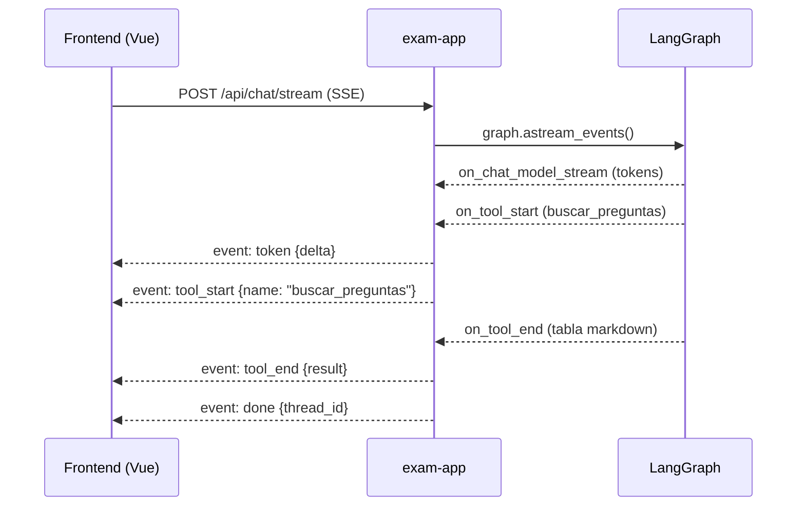

# Plan: Frontend propio con chat embebido (Vue 3 + SSE + WebSockets)

> Informe de viabilidad + plan de implementación por fases para reemplazar/complementar OpenWebUI con un frontend propio.
> Estado: pendiente de refinamiento. Fecha: 2026-10-04.
> **Actualización:** la arquitectura objetivo del monorepo (raíz de proyectos en `apps/`, arquitectura limpia por app) está diseñada en [docs/arquitectura-objetivo.md](docs/arquitectura-objetivo.md). Se añade la **Fase 0** de reestructuración previa a F1.

---

## 1. Objetivo

Reemplazar la interfaz de OpenWebUI por un frontend propio (Vue 3) que:
- Embeba el chat con el agente (motor = grafo LangGraph existente, vía API directa, NO iframe).
- Sea **reactivo** al ciclo del agente: tokens en vivo, progreso de tools, artefactos como widgets.
- Añada pantallas propias: Materias, Banco de preguntas, Exámenes, Material.
- Soporte adjuntos por ambos caminos: endpoint propio del backend (primario) y OpenWebUI (legado).
- Use **SSE** como canal principal del chat + **un WebSocket** como bus de eventos (notificaciones, cancelación, presencia).

## 2. Estado actual (línea base)

```
Navegador ──> OpenWebUI (:3000) ──> exam-app (:8000) ──> LLM local (vLLM GLM-5.3-Flash)
                    │                     │
                    │                     ├── Postgres + pgvector (checkpointer + banco)
                    │                     ├── latex-compiler (:8080)
                    │                     └── embedding-service (:8081)
                    └── guarda PDFs/CSV/XLSX como adjuntos propios
```

### Lo que OpenWebUI hace hoy (a asumir por el frontend)

| Función | Cómo se hace hoy | Dificultad de reemplazo |
|---|---|---|
| Interfaz de chat con streaming | SSE fake (backend re-chunkea texto completo en trozos de 20 chars) | 🟢 Baja |
| Historial de conversaciones | `thread_id` + PostgresSaver (ya funciona, se devuelve en cada respuesta) | 🟢 Baja |
| Subida de adjuntos (material) | OpenWebUI extrae texto → tag `<file id/>` → tool `agregar_material_archivo` | 🟡 Media |
| Descarga de artefactos (PDF/CSV/XLSX) | Links a `:3000/api/v1/files/{id}/content` con fallback `:8000/output/{name}` | 🟢 Baja |
| Render de markdown/tablas | MarkdownIt de OpenWebUI | 🟢 Baja |
| Autenticación/sesiones | WEBUI_AUTH=false (un solo usuario) | 🟢 Baja (MVP sin auth) |

### Hallazgos técnicos clave (exploración del repo)

- **Streaming es FALSO**: `src/api/chat.py` ejecuta `conversational_graph.invoke()` (sync, completo) y luego re-chunkea el texto final en trozos de 20 caracteres SSE. No hay tokens reales ni eventos de tools.
- **Sin CORS** en todo el repo; sin websockets; sin frontend existente (greenfield).
- **thread_id** ya se devuelve como campo extra en la respuesta y se persiste con PostgresSaver → continuidad de conversación lista para usar.
- **Artefactos son markdown-only**: las tools devuelven strings con tablas markdown y links (`[Descargar el PDF](http://localhost:3000/api/v1/files/{id}/content)`, fallback `http://localhost:8000/output/...`). No hay payloads estructurados para widgets.
- **Grafo sync bloquea el event loop**: PostgresSaver con `Connection.connect` sync + `graph.invoke` sync dentro de endpoint async de FastAPI.
- **HITL**: los `interrupt()` fueron eliminados del grafo (OpenWebUI no podía reanudarlos); la confirmación es a nivel de prompt. El endpoint `resume` existe pero es dead code.
- **`_PENDING_ITEM` es global de módulo** (`src/agents/conversational/tools.py`): no thread-safe, se pierde al reiniciar, compartido entre todos los threads/usuarios.
- **Endpoints REST existentes** (`main.py`): `/health`, `/subjects`, `/subjects/{id}/index`, `/exams/generate`, `/output/{filename}` (sirve .pdf/.csv/.xlsx con mime correcto).
- **entrypoint**: `alembic upgrade head` + `uvicorn main:app --host 0.0.0.0 --port 8000` (single worker).
- **Acoplamiento a OpenWebUI acotado a 2 archivos**: `src/api/chat.py` (formato OpenAI) y `src/api/openwebui.py` (subida/descarga de archivos, JWT signin).

## 3. Veredicto: VIABLE, con 3 cambios de fondo

### Cambio 1 — Streaming real (crítico)

Reemplazar el invoke-sync + re-chunk por `graph.astream_events(..., version="v2")`:



No hay que tocar el grafo: solo el endpoint. ~150 líneas → tokens en vivo + indicadores de progreso + eventos de tool.

### Cambio 2 — WebSocket como bus de eventos (complemento)

SSE cubre servidor→cliente (tokens, progreso, artefactos). WebSocket para:
- Notificaciones push (ej. "examen compilado" del pipeline batch en background).
- Cancelación de generación en curso (`stop`).
- Presencia/estado compartido (futuro multiusuario).

**No usar socket.io para el chat**: SSE como canal principal del chat (simple, reconexión automática, atraviesa proxies) + 1 WebSocket único de bus.

### Cambio 3 — Adjuntos con endpoint propio

`POST /api/files` en exam-app: recibe binario → extrae texto (ya existe `extract_file_text` en `src/bank/material.py`) → guarda en `data/inputs/<Materia>/` → indexa en `material_chunks`. ~80 líneas reutilizando lo existente. El tag `<file id/>` se mantiene como convención interna para que `agregar_material_archivo` siga funcionando.

### iframe descartado (razones)

| Criterio | iframe de OpenWebUI | API directa |
|---|---|---|
| Reactividad a tools del agente | ❌ Imposible | ✅ Eventos SSE nativos |
| Widgets propios alrededor del chat | ❌ CSS hacks frágiles (ya sufridos con custom.css) | ✅ Componentes Vue nativos |
| HITL con botones propios | ❌ Solo texto libre | ✅ Botones que llaman a la API |
| Mantenimiento | Dependes de versiones de OpenWebUI | Propio |
| Esfuerzo inicial | Bajo | Medio |

**El motor de chat ya existe**: es el grafo LangGraph con 11 tools. OpenWebUI nunca fue el motor, era la piel.

## 4. Arquitectura objetivo

```
┌─────────────────── Frontend Vue 3 ───────────────────┐
│  Pantallas: Materias · Banco · Exámenes · Material   │
│  ┌──────────── ChatPanel (componente) ────────────┐  │
│  │  MessageList · ToolActivity · ArtifactCard     │  │
│  │  HITLButtons · FileDrop · MarkdownRenderer     │  │
│  └────────────────────────────────────────────────┘  │
└──────────┬─────────────────────────┬─────────────────┘
           │ SSE + REST              │ WebSocket (bus)
┌──────────▼─────────────────────────▼─────────────────┐
│                  exam-app (FastAPI)                   │
│  /api/chat/stream (SSE, astream_events)               │
│  /api/chat (REST fallback) · /api/files (adjuntos)    │
│  /api/subjects · /api/questions · /api/exams          │
│  /ws (bus de eventos: notificaciones, cancel)         │
│  ChatEngine: LangGraph (propio) ← ya existe           │
└───────────────────────────────────────────────────────┘
```

## 5. Widgets (el valor real de la reactividad)

| Evento del agente | Widget en el frontend |
|---|---|
| `generar_pregunta` termina | Tarjeta de pregunta con opciones clicables + botones [Guardar] [Verificar] [Descartar] |
| `buscar_preguntas` termina | Tabla interactiva (ordenar, filtrar, click→detalle) |
| `generar_examen_pdf` termina | Card de artefacto con preview + botón descarga |
| `exportar_preguntas` termina | Card con botones CSV/Excel |
| `agregar_material_archivo` | Toast de progreso + confirmación con nº de chunks |
| Tool en ejecución | Indicador "🔍 Buscando en el banco…" con spinner |
| HITL pendiente | Banner de confirmación con acciones |

Mecanismo: las tools emiten **eventos tipados** (`question_generated`, `questions_listed`, `artifact_ready`) en paralelo al markdown; el endpoint SSE los reenvía; el frontend los renderiza como widgets. El markdown se conserva para historial/fallback.

## 6. Riesgos y mitigaciones

| Riesgo | Impacto | Mitigación |
|---|---|---|
| Grafo sync bloquea el event loop | SSE no concurrente, timeouts | Ejecutar en threadpool (`asyncio.to_thread`); migrar a `AsyncPostgresSaver` después si hace falta |
| `_PENDING_ITEM` global de módulo | Cross-talk entre usuarios | Moverlo a `ConversationalState` (el checkpointer ya persiste por thread) |
| LLM local lento (GLM razona) | Tokens tardan | Eventos `tool_start`/`thinking` mantienen la UI viva |
| Alcance extendido grande | Nada usable a tiempo | Fases: chat reactivo primero |
| Adjuntos duales | Complejidad | Endpoint propio primario; OpenWebUI queda como legado |

## 7. Plan por fases

### F0 — Reestructuración del monorepo (1-2 sesiones) ← NUEVA, previa a F1
> Detalle completo en [docs/arquitectura-objetivo.md](docs/arquitectura-objetivo.md) (§2 estructura, §4 mapa de migración, §8 repos + submódulos).

- [ ] Crear `apps/` (frontend, exam-app, agents-backend, latex-compiler, embedding-service) y `libs/core`.
- [ ] Migrar código Python con `git mv` según el mapa de migración (§4); actualizar imports.
- [ ] Mover Dockerfiles dentro de cada app; actualizar `docker/` y `deploy/` compose.
- [ ] Reapuntar `alembic.ini` a las migraciones en `libs/core`.
- [ ] Reubicar tests por app/lib; suite verde.
- [ ] Convertir cada app/lib en repo propio y agregarlos como **submódulos git** al meta-repo (§8.6).
- [ ] Criterio de aceptación: tests OK + pipeline end-to-end genera PDF + exam-app en :8000 + clon limpio con `--recurse-submodules` funciona.

### F1 — Backend reactivo (2-3 sesiones)
- [ ] CORS middleware en `main.py` (origen del frontend dev).
- [ ] `POST /api/chat/stream`: SSE con `astream_events(version="v2")` en threadpool; eventos: `token`, `tool_start`, `tool_end`, `thinking`, `done`, `error`.
- [ ] Eventos tipados de tools (canal paralelo al markdown): `question_generated`, `questions_listed`, `artifact_ready`, `material_indexed`.
- [ ] `POST /api/files`: subida propia de adjuntos (extraer → guardar → indexar).
- [ ] `WS /ws`: bus de eventos (notificaciones, cancelación).
- [ ] Mover `_PENDING_ITEM` a `ConversationalState`.
- [ ] Mantener `/v1/chat/completions` intacto (OpenWebUI legado).

### F2 — Frontend base (2-3 sesiones)
- [ ] Scaffold Vue 3 + Vite + TypeScript + Pinia + Vue Router.
- [ ] Layout con navegación (Materias · Banco · Exámenes · Material · Chat).
- [ ] Cliente SSE (EventSource/fetch-stream) + cliente WS con reconexión.
- [ ] `ChatPanel`: MessageList, input, streaming real de tokens, markdown renderer.
- [ ] Gestión de `thread_id` (persistencia por conversación, lista de chats).

### F3 — Widgets del chat (2 sesiones)
- [ ] Tarjeta de pregunta generada con acciones HITL (guardar/verificar/descartar).
- [ ] Tabla interactiva de preguntas del banco.
- [ ] Cards de artefactos (PDF/CSV/XLSX) con descarga.
- [ ] Indicadores de actividad de tools (spinner por tool).
- [ ] FileDrop de adjuntos → `POST /api/files`.

### F4 — Pantallas (2-3 sesiones)
- [ ] Materias: listar, registrar, material indexado por materia.
- [ ] Banco de preguntas: grid/tabla con filtros, detalle, verificación humana, exportar CSV/Excel.
- [ ] Exámenes: generar (blueprint simple), versiones, descarga de PDFs.
- [ ] Material: subir archivos, ver fragmentos indexados, re-indexar.

### F5 — Docker + pulido (1 sesión)
- [ ] Dockerfile del frontend (build Vite → nginx o servido por exam-app).
- [ ] Actualizar `docker/docker-compose.yml` (servicio `frontend`; open-webui opcional).
- [ ] Actualizar `deploy/docker-compose.yml`.
- [ ] Variables de entorno de URLs (API_URL, WS_URL) para dev/deploy.

**Total estimado: ~10-14 sesiones. MVP usable (F0+F1+F2): 6-8.**

## 8. Decisiones abiertas (refinar)

> Varias ya quedaron resueltas por la arquitectura objetivo ([docs/arquitectura-objetivo.md](docs/arquitectura-objetivo.md), §6): servir el frontend con nginx separado, nombre `apps/frontend/`, schema versionado de eventos SSE/WS, historial en localStorage para el MVP, cancelación vía WS ignorando la respuesta, sin auth en el MVP.

- [ ] ¿Servir el build de Vue desde exam-app (StaticFiles) o contenedor nginx separado? → **Resuelto: nginx separado.**
- [ ] ¿Auth mínima para el frontend (un usuario simple) o sin auth en el MVP? → **Resuelto: sin auth en MVP.**
- [ ] Formato exacto de eventos SSE (naming, versionado del schema de eventos). → **Resuelto: schema versionado `v` (§5 de la arquitectura objetivo).**
- [ ] ¿Cancelar generación: abortar el thread del grafo o solo ignorar la respuesta? → **Resuelto: ignorar respuesta vía event_bus; abortar como mejora.**
- [ ] ¿Historial de chats en el frontend: localStorage o endpoint de listado de threads (query al checkpointer)? → **Resuelto: localStorage en MVP.**
- [ ] Nombre del paquete/carpeta del frontend (ej. `frontend/` o `web/`). → **Resuelto: `apps/frontend/`.**
